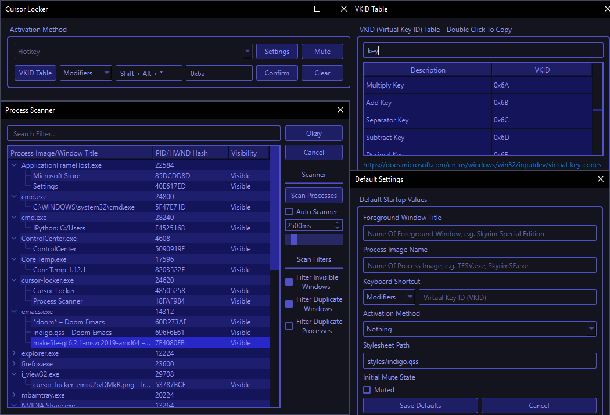

# Indigo QSS Stylesheet
This is a QSS (Qt CSS) stylesheet for Qt applications. I originally designed this stylesheet for my [cursor-locker](https://github.com/PsychedelicShayna/cursor-locker) application, but have been using it in various other projects ever since. As the name suggests, Indigo is a purple-ish, blue-ish dark stylesheet, created with the intention of looking modern, elegant, vibrant, colorful, and sleek. 

This repository is meant to be used as a submodule in other repositories, and when doing so, the "include" branch should be used for convenience.

In order to generate the `indigo.rcc` compiled resource file, run the makefile after having adjusted the makefile so that the `rccpath` variable points to the `rcc.exe` binary in your Qt installation. 

## Screenshot
_Screenshot taken from the GUI of: [cursor-locker](https://github.com/PsychedelicShayna/cursor-locker)_

